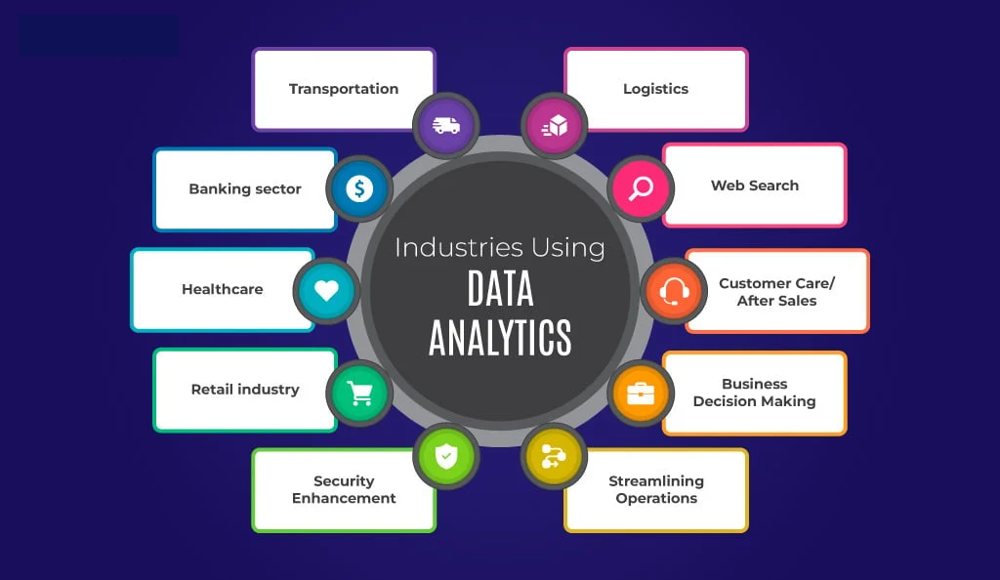
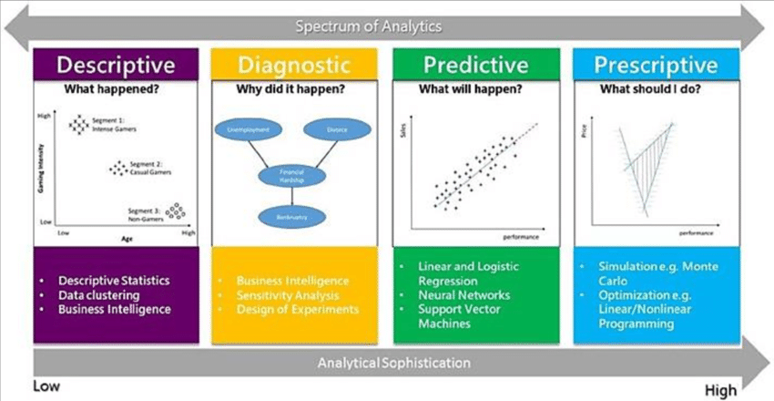

# 📊 Lesson 1: What is Data Analysis? 🔍

## Overview
**Duration**: 1 hour
**Date**: April 26, 2025
 

---

## 🎯 Learning Objectives
- Understand the fundamental definition of data analysis
- Recognize the critical role of data in modern decision-making
- Explore real-world applications of data analytics
- Identify how data analysis applies to various industries and everyday life

---

## 1. 🔍 Definition of Data Analysis

Data analysis is the process of inspecting, cleansing, transforming, and modeling data with the goal of discovering useful information, drawing conclusions, and supporting decision-making.

<blockquote style="font-style: italic; font-size: 1.1em; margin: 0;">
"Data analysis is the process of bringing structure to data, identifying patterns, and extracting insights."
</blockquote>

### Key Components:
| Component | Description |
|:----------|:------------|
| **📥 Data Collection** | Gathering relevant information from various sources |
| **🧹 Data Cleaning** | Removing errors, handling missing values, and formatting data |
| **⚙️ Data Processing** | Transforming raw data into a usable format |
| **💡 Data Interpretation** | Drawing meaningful conclusions from patterns |
| **📈 Data Visualization** | Presenting findings in an understandable format |

  

---

## 2. 🌟 Importance of Data in Decision-Making

### Why Data Matters:

  

    <h4 style="margin-top: 0; color: #2e7d32;">🎯 Reduces Uncertainty</h4>
    
Provides evidence-based grounds for decisions rather than relying on intuition alone

  

  

    <h4 style="margin-top: 0; color: #ef6c00;">💰 Identifies Opportunities</h4>
    
Reveals patterns and trends that may not be immediately visible to the human eye

  

  

    <h4 style="margin-top: 0; color: #0097a7;">⏱️ Improves Efficiency</h4>
    
Helps target resources where they'll have the greatest impact on outcomes

  

  

    <h4 style="margin-top: 0; color: #7b1fa2;">🔮 Enables Prediction</h4>
    
Allows forecasting of future trends based on historical patterns and relationships

  

  

    <h4 style="margin-top: 0; color: #3949ab;">✅ Validates Hypotheses</h4>
    
Tests assumptions with objective measurements and statistical significance

  

<strong>💼 Case Study</strong>: A retail company that implemented data-driven inventory management reduced waste by 35% and increased profits by 15% within one year.

---

## 3. 🌏 Real-World Examples of Data-Driven Decisions

  

### Business Applications 🏢

  
📈

  

    <h4 style="margin-top: 0; margin-bottom: 5px;">Sales Forecasting</h4>
    
Analyzing past sales data to predict future demand

    
Example: Amazon's anticipatory shipping system predicts what customers will buy before they order

  

  
📊

  

    <h4 style="margin-top: 0; margin-bottom: 5px;">Market Trend Analysis</h4>
    
Identifying emerging patterns in consumer behavior

    
Example: Netflix uses viewing data to decide which shows to produce

  

  
👥

  

    <h4 style="margin-top: 0; margin-bottom: 5px;">Customer Segmentation</h4>
    
Grouping customers based on behavior and preferences

    
Example: Target identifying pregnant customers through purchasing patterns

  

### Healthcare Applications 🏥

  
🏥

  

    <h4 style="margin-top: 0; margin-bottom: 5px;">Patient Records Analysis</h4>
    
Improving treatments based on historical outcomes

    
Example: Predictive models identifying patients at risk for readmission

  

  
🦠

  

    <h4 style="margin-top: 0; margin-bottom: 5px;">Epidemic Tracking</h4>
    
Monitoring disease spread patterns

    
Example: Contact tracing and hotspot identification during COVID-19

  

  
⚕️

  

    <h4 style="margin-top: 0; margin-bottom: 5px;">Resource Allocation</h4>
    
Optimizing staff schedules and medical supplies

    
Example: Hospital emergency department staffing based on historical admission patterns

  

### Social Media Applications 📱

  
👤

  

    <h4 style="margin-top: 0; margin-bottom: 5px;">User Behavior Analysis</h4>
    
Understanding engagement patterns

    
Example: TikTok's recommendation algorithm analyzing viewing time

  

  
😀

  

    <h4 style="margin-top: 0; margin-bottom: 5px;">Sentiment Analysis</h4>
    
Gauging public opinion on topics, brands, or events

    
Example: Companies monitoring Twitter reactions to product launches

  

  
🔗

  

    <h4 style="margin-top: 0; margin-bottom: 5px;">Network Analysis</h4>
    
Mapping relationships between users

    
Example: LinkedIn's "People You May Know" suggestions

  

<table style="border-collapse: collapse; width: 90%; box-shadow: 0 4px 8px rgba(0,0,0,0.1);">
  <tr>
    <th style="background-color: #263238; color: white; padding: 15px; text-align: center; border-bottom: 3px solid #37474f;">Industry</th>
    <th style="background-color: #263238; color: white; padding: 15px; text-align: center; border-bottom: 3px solid #37474f;">Data Sources</th>
    <th style="background-color: #263238; color: white; padding: 15px; text-align: center; border-bottom: 3px solid #37474f;">Key Analytics</th>
  </tr>
  <tr>
    <td style="background-color: #eceff1; border: 1px solid #cfd8dc; padding: 12px; text-align: center; font-weight: bold;">🛍️ Retail</td>
    <td style="border: 1px solid #cfd8dc; padding: 12px;">Transaction data, Website behavior, Loyalty programs</td>
    <td style="border: 1px solid #cfd8dc; padding: 12px;">Basket analysis, Customer lifetime value, Inventory optimization</td>
  </tr>
  <tr>
    <td style="background-color: #eceff1; border: 1px solid #cfd8dc; padding: 12px; text-align: center; font-weight: bold;">🏥 Healthcare</td>
    <td style="border: 1px solid #cfd8dc; padding: 12px;">Patient records, Treatment outcomes, Billing data</td>
    <td style="border: 1px solid #cfd8dc; padding: 12px;">Treatment efficacy, Readmission risk, Cost optimization</td>
  </tr>
  <tr>
    <td style="background-color: #eceff1; border: 1px solid #cfd8dc; padding: 12px; text-align: center; font-weight: bold;">💰 Financial Services</td>
    <td style="border: 1px solid #cfd8dc; padding: 12px;">Transaction history, Market data, Customer profiles</td>
    <td style="border: 1px solid #cfd8dc; padding: 12px;">Fraud detection, Risk assessment, Investment performance</td>
  </tr>
  <tr>
    <td style="background-color: #eceff1; border: 1px solid #cfd8dc; padding: 12px; text-align: center; font-weight: bold;">📱 Social Media</td>
    <td style="border: 1px solid #cfd8dc; padding: 12px;">User interactions, Content engagement, Demographic data</td>
    <td style="border: 1px solid #cfd8dc; padding: 12px;">Engagement metrics, Content recommendations, Ad targeting</td>
  </tr>
</table>

---

## 4. 🔄 Brief Overview of Data Analytics Applications

### Types of Data Analytics:

  

    

      
📜

      <h3 style="margin: 0;">Descriptive Analytics</h3>
    

    
<strong>Focus:</strong> Understanding what happened

    
<strong>Question answered:</strong> "What occurred?"

    
<strong>Example:</strong> Monthly sales reports, website traffic statistics

    
<strong>Tools:</strong> Reports, dashboards, basic visualizations

    

      
<em>"Our average sales decreased by 5% compared to last quarter."</em>

    

  

  

    

      
🔍

      <h3 style="margin: 0;">Diagnostic Analytics</h3>
    

    
<strong>Focus:</strong> Understanding why it happened

    
<strong>Question answered:</strong> "Why did it occur?"

    
<strong>Example:</strong> Analyzing why sales dropped in a particular region

    
<strong>Tools:</strong> Drill-down analysis, correlation analysis, root cause exploration

    

      
<em>"Sales decreased because our main competitor launched a discount campaign."</em>

    

  

  

    

      
🔮

      <h3 style="margin: 0;">Predictive Analytics</h3>
    

    
<strong>Focus:</strong> Forecasting what might happen

    
<strong>Question answered:</strong> "What is likely to occur?"

    
<strong>Example:</strong> Weather forecasts, stock market predictions

    
<strong>Tools:</strong> Regression analysis, machine learning models, time series forecasting

    

      
<em>"Based on current trends, we forecast a 12% sales increase next quarter."</em>

    

  

  

    

      
🧭

      <h3 style="margin: 0;">Prescriptive Analytics</h3>
    

    
<strong>Focus:</strong> Determining actions to take

    
<strong>Question answered:</strong> "What should we do?"

    
<strong>Example:</strong> Automated inventory ordering systems, personalized medicine

    
<strong>Tools:</strong> Optimization algorithms, simulation, decision trees, AI

    

      
<em>"To maximize profits next quarter, increase production of Product A by 15% and reduce marketing for Product B."</em>

    

  

  

### Emerging Fields:

  

    <h4 style="margin-top: 0; color: #00838f;">📊 Big Data Analytics</h4>
    
Processing extremely large datasets that exceed the capabilities of traditional data processing software

  

  

    <h4 style="margin-top: 0; color: #558b2f;">🔌 IoT Analytics</h4>
    
Analyzing data streams from connected devices and sensors to optimize processes and experiences

  

  

    <h4 style="margin-top: 0; color: #3949ab;">🧠 AI and Machine Learning</h4>
    
Automating pattern recognition and enabling systems to learn from data without explicit programming

  

  

    <h4 style="margin-top: 0; color: #c2185b;">⚖️ Data Ethics</h4>
    
Addressing privacy, fairness, and responsible use concerns in data collection and analysis

  

  

    <h3 style="text-align: center; margin-top: 0;">Analytics Maturity Scale</h3>
    

      

        
📜

        
Descriptive

        
Basic

      

      

        
🔍

        
Diagnostic

        
Intermediate

      

      

        
🔮

        
Predictive

        
Advanced

      

      

        
🧭

        
Prescriptive

        
Expert

      

    

    

      Most organizations are at the descriptive/diagnostic stages and working toward predictive capabilities
    

  

---

## 📝 Activity: Applying Data Analysis Concepts

### Group Discussion (20 minutes)
In groups of 3-4, identify and discuss:

<h4 style="margin-top: 0; color: #8a6d3b;">💬 Discussion Topics</h4>
<ol>
  <li><strong>Personal Data Use</strong>:
    <ul>
      <li>How do you use data to make decisions in your daily life?</li>
      <li>What apps or services do you use that clearly employ data analysis?</li>
    </ul>
  </li>
  <li><strong>Professional Applications</strong>:
    <ul>
      <li>Identify 3-5 ways data analysis is or could be applied in your industry or field of interest</li>
      <li>What decisions in your workplace could benefit from better data analysis?</li>
    </ul>
  </li>
  <li><strong>Ethical Considerations</strong>:
    <ul>
      <li>What privacy concerns arise from the data examples you've identified?</li>
      <li>How can organizations balance data collection with user privacy?</li>
    </ul>
  </li>
</ol>

  <h4 style="margin-top: 0;">⏱️ Discussion Timeline</h4>
  

    
5m

    

      Personal Data Use examples
    

  

  

    
10m

    

      Professional Applications discussion
    

  

  

    
5m

    

      Ethical Considerations debate
    

  

### Reporting Back (10 minutes)
Each group will share their most interesting findings with the class.

---

## 📚 Additional Resources

  

    <h3 style="margin-top: 0;">📕 Recommended Reading</h3>
    <ul>
      <li><a href="https://www.storytellingwithdata.com/" style="text-decoration: none; color: #0277bd;">
        <strong>"Storytelling with Data"</strong> by Cole Nussbaumer Knaflic</a>
        
Learn how to effectively communicate insights through data visualization

      </li>
      <li><a href="https://data-science-for-biz.com/" style="text-decoration: none; color: #0277bd;">
        <strong>"Data Science for Business"</strong> by Foster Provost & Tom Fawcett</a>
        
Fundamental principles of data science and their business applications

      </li>
    </ul>
  

  

    <h3 style="margin-top: 0;">🔗 Online Resources</h3>
    <ul>
      <li><a href="https://www.coursera.org/professional-certificates/google-data-analytics" style="text-decoration: none; color: #0277bd;">
        <strong>Google's Data Analytics Professional Certificate</strong></a>
        
Comprehensive online course covering all aspects of data analysis

      </li>
      <li><a href="https://www.khanacademy.org/math/statistics-probability" style="text-decoration: none; color: #0277bd;">
        <strong>Khan Academy's Statistics and Probability</strong></a>
        
Free resources to understand the statistical foundations of data analysis

      </li>
      <li><a href="https://public.tableau.com/en-us/s/gallery" style="text-decoration: none; color: #0277bd;">
        <strong>Tableau Public</strong></a>
        
Gallery of data visualizations for inspiration and learning

      </li>
    </ul>
  

---

## 📋 Homework

  <h3 style="margin-top: 0;">✍️ Assignment Tasks</h3>

  

    
1

    

      
<strong>Find and analyze an example of data-driven decision making in the news</strong>

      
Identify the data sources used, how the data was analyzed, and the outcomes of the decision

    

  

  

    
2

    

      
<strong>Write a brief reflection (1-2 paragraphs) on how data analysis could improve a process you're familiar with</strong>

      
Consider what data would be needed, how it would be collected, and what insights it might reveal

    

  

  

    

      
📅

      
<strong>Due date:</strong> May 3, 2025 (before next class)

    

    

      
📝

      
<strong>Submission format:</strong> PDF or Word document via the course portal

    

  

  <h3 style="margin-top: 0; display: flex; align-items: center;">💪 Challenge Exercise (Optional)</h3>
  
Find a public dataset that interests you on <a href="https://data.gov" style="color: #0277bd;">data.gov</a> or <a href="https://kaggle.com/datasets" style="color: #0277bd;">Kaggle</a>. Write three questions that could be answered with this data and explain why these questions would be valuable to investigate.

  

    
<strong>Tip:</strong> Look for datasets related to your field of interest or a current social issue you care about. This will make the exercise more engaging and relevant to your goals.

  

---

  

    <strong>🗓️ Today:</strong> April 26, 2025
  

  

    
Next Lesson: Data Collection and Preparation Techniques

    
Date: May 3, 2025

  

  

    ✓ <strong>Lesson 1 Complete</strong> - 1 of 6 ✓ 
    

      

    

  

