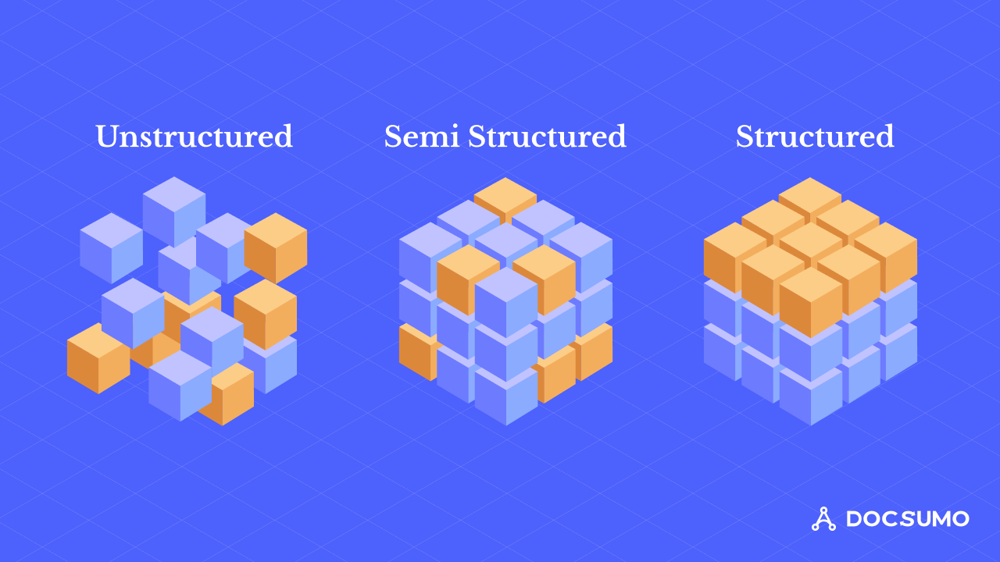

# 📊 Lesson 2: Types of Data and Data Collection

## Overview
**Duration**: 1 hour
**Date**: May 3, 2025
 

---

## 🎯 Learning Objectives
- Differentiate between qualitative and quantitative data
- Understand structured and unstructured data formats
- Identify appropriate sources of data for different analysis needs
- Recognize the importance of data quality, ethics, and privacy compliance

---

## 1. 📊 Qualitative vs. Quantitative Data

<table style="border-collapse: collapse; width: 90%;">
  <tr>
    <th style="background-color: #3f6184; color: white; padding: 12px; text-align: center; width: 50%;">Quantitative Data</th>
    <th style="background-color: #7d4e57; color: white; padding: 12px; text-align: center; width: 50%;">Qualitative Data</th>
  </tr>
  <tr>
    <td style="border: 1px solid #ccc; padding: 10px; vertical-align: top;">
      <strong>📏 Definition:</strong> Information that can be counted, measured, and expressed using numbers  
      <strong>🔢 Answers questions like:</strong> "How much," "how many," or "how often"
    </td>
    <td style="border: 1px solid #ccc; padding: 10px; vertical-align: top;">
      <strong>📝 Definition:</strong> Describes qualities or characteristics that cannot be easily measured with numbers  
      <strong>❓ Answers questions like:</strong> "why," "how," or "what"
    </td>
  </tr>
</table>

### Quantitative Data

**Key Characteristics:**
- 🔢 Numerical in nature
- 📈 Can be used for statistical analysis
- 📐 Objective measurement
- 🧮 Mathematical operations can be performed on it

**Examples:**
- Age: 25 years
- Temperature: 72°F
- Income: $65,000/year
- Time: 45 minutes
- Score: 85/100

<h4 style="margin-top: 0;">Subtypes of Quantitative Data</h4>

  

    <h5>📊 Discrete Data</h5>
    <ul>
      <li>Whole numbers/countable values</li>
      <li>Finite number of possible values</li>
      <li>Cannot be divided into smaller parts</li>
      <li><em>Examples:</em> Number of students, children, cars</li>
    </ul>
  

  

    <h5>📈 Continuous Data</h5>
    <ul>
      <li>Can take any value within a range</li>
      <li>Infinite number of possible values</li>
      <li>Can be divided into smaller parts</li>
      <li><em>Examples:</em> Height, weight, temperature</li>
    </ul>
  

### Qualitative Data

**Key Characteristics:**
- 📝 Descriptive rather than numerical
- 💬 Focuses on experiences, opinions, and attributes
- 🧠 Often subjective
- 🔍 Rich and detailed information

**Examples:**
- Gender: Male, Female, Non-binary
- Color preference: Blue
- Product feedback: "The interface is confusing"
- Mood: Happy, Sad, Anxious
- Category: Vegetable, Fruit, Grain

<h4 style="margin-top: 0;">Subtypes of Qualitative Data</h4>

  

    <h5>🏷️ Nominal Data</h5>
    <ul>
      <li>Categories with no inherent order</li>
      <li>Cannot be ranked or compared meaningfully</li>
      <li><em>Examples:</em> Blood types, eye colors, nationalities</li>
    </ul>
  

  

    <h5>📋 Ordinal Data</h5>
    <ul>
      <li>Categories with a meaningful order/rank</li>
      <li>Differences between values may not be consistent</li>
      <li><em>Examples:</em> Rating scales, education levels, rankings</li>
    </ul>
  

> **💡 Note**: Both data types are valuable, and many robust analyses combine qualitative and quantitative approaches.

---

## 2. 🗂️ Structured vs. Unstructured Data

  

### Structured Data
Structured data is organized in a predefined format, making it easily searchable and analyzable.

  

    📋
  

  

    <h4 style="margin-top: 0;">Key Characteristics:</h4>
    <ul>
      <li>Follows a strict, predefined model</li>
      <li>Organized in rows and columns</li>
      <li>Easy to search and analyze with standard tools</li>
      <li>Typically stored in relational databases</li>
    </ul>
  

**Examples:**
- Excel spreadsheets
- SQL databases
- CSV files
- Survey results with fixed responses
- Financial records

### Unstructured Data
Unstructured data lacks a predefined data model and doesn't fit neatly into traditional databases.

  

    🌐
  

  

    <h4 style="margin-top: 0;">Key Characteristics:</h4>
    <ul>
      <li>No predefined organization or format</li>
      <li>Difficult to search with conventional tools</li>
      <li>Requires specialized processing techniques</li>
      <li>Contains rich and complex information</li>
    </ul>
  

**Examples:**
- Email messages
- Social media posts
- Video and audio recordings
- Images and photographs
- Open-ended survey responses

### Semi-Structured Data
A hybrid category that contains elements of both structured and unstructured data.

  

    🔄
  

  

    <h4 style="margin-top: 0;">Key Characteristics:</h4>
    <ul>
      <li>Has some organizational properties but doesn't conform to strict formats</li>
      <li>Contains tags or markers that separate elements</li>
      <li>More flexible than structured data but more organized than unstructured</li>
    </ul>
  

**Examples:**
- JSON files
- XML documents
- HTML webpages
- Email headers combined with message body

---

## 3. 📂 Sources of Data

<table style="border-collapse: collapse; width: 90%; text-align: center;">
  <tr>
    <th colspan="2" style="background-color: #3a506b; color: white; padding: 10px;">Data Sources</th>
  </tr>
  <tr>
    <td style="background-color: #1d3557; color: white; padding: 12px; width: 50%;">Primary Sources</td>
    <td style="background-color: #457b9d; color: white; padding: 12px; width: 50%;">Secondary Sources</td>
  </tr>
  <tr>
    <td style="border: 1px solid #ccc; padding: 8px; text-align: left; vertical-align: top;">
      <ul>
        <li>Surveys and questionnaires</li>
        <li>Interviews and focus groups</li>
        <li>Direct observations</li>
        <li>Experiments</li>
        <li>Field research</li>
      </ul>
    </td>
    <td style="border: 1px solid #ccc; padding: 8px; text-align: left; vertical-align: top;">
      <ul>
        <li>Public databases</li>
        <li>Government reports</li>
        <li>Academic publications</li>
        <li>Industry reports</li>
        <li>Web and social media data</li>
      </ul>
    </td>
  </tr>
</table>

### Primary Data Sources
Primary data is collected directly by the researcher for a specific purpose.

  

    <h4>✅ Advantages</h4>
    <ul>
      <li>Collected for the specific research question</li>
      <li>Researcher has full control over collection methods</li>
      <li>Known quality and reliability</li>
      <li>Proprietary information advantage</li>
    </ul>
  

  

    <h4>⚠️ Disadvantages</h4>
    <ul>
      <li>Time-consuming and expensive to collect</li>
      <li>Requires expertise in research design</li>
      <li>Limited sample size possible</li>
      <li>May introduce researcher bias</li>
    </ul>
  

#### Common Primary Data Collection Methods:

<h5>📝 Surveys and Questionnaires</h5>
<ul>
  <li>Online surveys (e.g., Google Forms, SurveyMonkey)</li>
  <li>Paper surveys</li>
  <li>Email questionnaires</li>
  <li>Mobile polling</li>
</ul>

<h5>🎙️ Interviews</h5>
<ul>
  <li>Structured interviews (predetermined questions)</li>
  <li>Semi-structured interviews (guided but flexible)</li>
  <li>Unstructured interviews (conversational)</li>
  <li>Focus groups (group discussions)</li>
</ul>

<h5>👁️ Observations</h5>
<ul>
  <li>Direct observation (watching behavior)</li>
  <li>Participant observation (immersion in setting)</li>
  <li>Field research (natural environment)</li>
  <li>Laboratory observations (controlled environment)</li>
</ul>

<h5>🧪 Experiments</h5>
<ul>
  <li>Controlled experiments (manipulating variables)</li>
  <li>Field experiments (real-world settings)</li>
  <li>A/B testing (comparing variations)</li>
</ul>

### Secondary Data Sources
Secondary data is collected by someone else for a different primary purpose.

  

    <h4>✅ Advantages</h4>
    <ul>
      <li>Time and cost-efficient</li>
      <li>Often larger sample sizes</li>
      <li>May cover longer time periods</li>
      <li>No data collection burden</li>
    </ul>
  

  

    <h4>⚠️ Disadvantages</h4>
    <ul>
      <li>Not tailored to specific research needs</li>
      <li>May be outdated</li>
      <li>Unknown quality or collection methods</li>
      <li>Potential accessibility or licensing issues</li>
    </ul>
  

#### Common Secondary Data Sources:

  

    <h5>🏛️ Public Records and Government Data</h5>
    <ul>
      <li>Census data</li>
      <li>Economic indicators</li>
      <li>Health statistics</li>
      <li>Weather data</li>
      <li>Crime statistics</li>
    </ul>
  

  

    <h5>💼 Commercial and Business Sources</h5>
    <ul>
      <li>Industry reports</li>
      <li>Market research</li>
      <li>Financial databases</li>
      <li>Company annual reports</li>
    </ul>
  

  

    <h5>🎓 Academic and Research Resources</h5>
    <ul>
      <li>Academic journals</li>
      <li>Research publications</li>
      <li>University repositories</li>
      <li>Case studies</li>
    </ul>
  

  

    <h5>🌐 Web and Digital Sources</h5>
    <ul>
      <li>Social media data</li>
      <li>Website analytics</li>
      <li>Online databases</li>
      <li>Digital archives</li>
      <li>API access to platforms</li>
    </ul>
  

---

## 4. 🛡️ Data Quality and Ethics

### Data Quality Dimensions

  

    <h4 style="margin-top: 0;">✓ Accuracy</h4>
    <ul>
      <li>Correctness of the data</li>
      <li>Free from errors and reliable</li>
      <li>Verified against trusted sources</li>
    </ul>
  

  

    <h4 style="margin-top: 0;">☑ Completeness</h4>
    <ul>
      <li>All required data is present</li>
      <li>No essential information missing</li>
      <li>Adequate population coverage</li>
    </ul>
  

  

    <h4 style="margin-top: 0;">🔄 Consistency</h4>
    <ul>
      <li>Data values don't contradict each other</li>
      <li>Uniform formatting across similar data</li>
      <li>Logical coherence within the dataset</li>
    </ul>
  

  

    <h4 style="margin-top: 0;">⏱️ Timeliness</h4>
    <ul>
      <li>Data is up-to-date</li>
      <li>Available when needed</li>
      <li>Relevant to the current situation</li>
    </ul>
  

  

    <h4 style="margin-top: 0;">🎯 Relevance</h4>
    <ul>
      <li>Applicable to the analysis objectives</li>
      <li>Adds value to decision-making</li>
      <li>Addresses the research question</li>
    </ul>
  

### Data Ethics and Privacy

<h4>🔑 Key Ethical Considerations</h4>

<h5>🤝 Informed Consent</h5>
<ul>
  <li>Participants understand how their data will be used</li>
  <li>Clear explanation of data collection purpose</li>
  <li>Option to withdraw consent</li>
</ul>

<h5>🔒 Privacy Protection</h5>
<ul>
  <li>Anonymization of personal information</li>
  <li>Secure data storage and transmission</li>
  <li>Limited access to sensitive information</li>
</ul>

<h5>📄 Data Ownership</h5>
<ul>
  <li>Clear policies on who owns collected data</li>
  <li>Transparency about data sharing practices</li>
  <li>Respecting intellectual property rights</li>
</ul>

<h4>⚖️ Compliance Frameworks</h4>

  

    <h5>🇪🇺 GDPR (General Data Protection Regulation)</h5>
    <ul>
      <li>European Union's comprehensive data protection law</li>
      <li>Rights for individuals to access and control their data</li>
      <li>Requirements for data breach notifications</li>
    </ul>
  

  

    <h5>🇺🇸 CCPA (California Consumer Privacy Act)</h5>
    <ul>
      <li>California's privacy legislation</li>
      <li>Consumer rights regarding personal information</li>
      <li>Opt-out options for data sales</li>
    </ul>
  

  

    <h5>⚕️ HIPAA (Health Insurance Portability and Accountability Act)</h5>
    <ul>
      <li>U.S. protection for medical information</li>
      <li>Security requirements for health data</li>
      <li>Patient rights to their health records</li>
    </ul>
  

> **💡 Best Practice**: Always implement privacy by design - building privacy considerations into data collection systems from the beginning rather than adding them later.

---

## 📝 Activity: Classifying Data Types

### Group Exercise (20 minutes)

<h4 style="margin-top: 0;">Instructions</h4>
<ol>
  <li>Form groups of 3-4</li>
  <li>For each example below, classify the data as:
    <ul>
      <li>Qualitative or Quantitative</li>
      <li>If Quantitative: Discrete or Continuous</li>
      <li>If Qualitative: Nominal or Ordinal</li>
      <li>Structured or Unstructured</li>
    </ul>
  </li>
  <li>Identify a potential primary and secondary source for each type of data</li>
</ol>

<h4>Examples to Classify:</h4>

<ol style="column-count: 2;">
  <li>Customer satisfaction ratings (1-5 stars)</li>
  <li>Employee email communications</li>
  <li>Annual revenue figures for a company</li>
  <li>Blood pressure readings</li>
  <li>Social media comments about a product</li>
  <li>Zip/postal codes</li>
  <li>College degrees (Bachelor's, Master's, PhD)</li>
  <li>Time to complete a marathon</li>
  <li>Security camera footage</li>
  <li>Product categories in an e-commerce store</li>
</ol>

### Discussion (10 minutes)
- Share your classifications with the class
- Discuss any examples where groups disagreed
- Consider how the data type influences how you would collect and analyze it

  

---

## 📚 Additional Resources

### Recommended Reading:
- [📕 "Data Science from Scratch" by Joel Grus](https://www.oreilly.com/library/view/data-science-from/9781492041122/)
- [📗 "Practical Statistics for Data Scientists" by Peter Bruce & Andrew Bruce](https://www.oreilly.com/library/view/practical-statistics-for/9781491952955/)

### Online Resources:
- [🔗 Types of Data in Statistics](https://www.khanacademy.org/math/statistics-probability/designing-studies/types-of-studies/v/types-of-data)
- [🔗 Data Ethics Framework](https://www.gov.uk/government/publications/data-ethics-framework)
- [🔗 GDPR Official Documentation](https://gdpr.eu/)

---

## 📋 Homework
1. Find three real-world datasets - one primarily quantitative, one primarily qualitative, and one that contains both types of data
2. For each dataset, identify:
   - The source (primary or secondary)
   - The structure (structured, semi-structured, or unstructured)
   - Any potential ethical considerations when using this data

<h3 style="margin-top: 0;">💪 Challenge Exercise (Optional)</h3>

Select a business or organization you're familiar with and create a data inventory. List 5-10 types of data they likely collect, and classify each according to the categories we've discussed today. For each data type, briefly note any ethical or privacy considerations that should be addressed.

---

Next Lesson: The Data Analysis Lifecycle

