# 📊 Lesson 3: The Data Analysis Lifecycle 🔍

## Overview
**Duration**: 1 hour
**Date**: May 10, 2025
 

---

## 🎯 Learning Objectives
- Understand the complete lifecycle of a data analysis project
- Identify the key activities and deliverables for each stage
- Recognize appropriate tools for different stages of analysis
- Apply the data analysis lifecycle to a practical example

---

## 1. 🔄 Introduction to the Data Analysis Lifecycle

The data analysis lifecycle is a structured approach to turning raw data into actionable insights. Each stage builds upon the previous one, creating a framework that ensures thoroughness, accuracy, and relevance in data-driven decision making.

<blockquote style="font-style: italic; font-size: 1.1em; margin: 0;">
"Good data analysis tells a story that answers the original question clearly and compellingly."
</blockquote>

  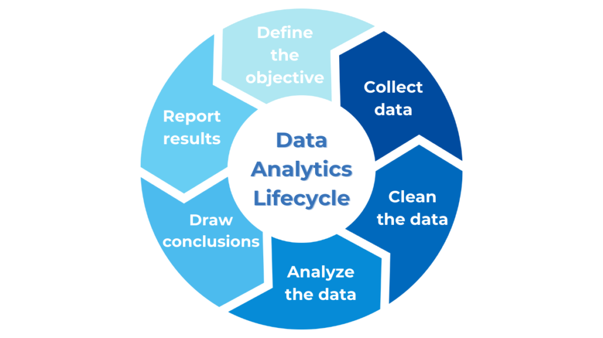

---

## 2. 🛠️ Stages of Data Analysis

  

    <h3 style="color: #1565c0;">📥 Data Collection</h3>
  

  

    <h3 style="color: #2e7d32;">🧹 Data Cleaning</h3>
  

  

    <h3 style="color: #7b1fa2;">🔍 Data Exploration</h3>
  

  

    <h3 style="color: #ef6c00;">📊 Data Visualization</h3>
  

  

    <h3 style="color: #0097a7;">📢 Communication</h3>
  

  

    <h3 style="color: #424242;">⚙️ Decision-Making</h3>
  

### Stage 1: Data Collection 📥

<h4 style="color: #1565c0; margin-top: 0;">🎯 Purpose</h4>

Gather relevant data from appropriate sources to address the research question or business need.

  

    <h4 style="color: #1565c0;">🔑 Key Activities</h4>
    <ul>
      <li>Define clear objectives and questions to be answered</li>
      <li>Identify potential data sources (internal systems, external providers, etc.)</li>
      <li>Determine collection methods (APIs, databases, surveys, etc.)</li>
      <li>Create a data collection plan with timelines</li>
      <li>Establish data governance standards for the project</li>
    </ul>
  

  

    <h4 style="color: #1565c0;">📦 Deliverables</h4>
    <ul>
      <li>Raw dataset(s)</li>
      <li>Data collection methodology documentation</li>
      <li>Initial data catalog or inventory</li>
    </ul>
    <h4 style="color: #c62828; margin-top: 20px;">⚠️ Challenges</h4>
    <ul>
      <li>Ensuring data relevance to the research question</li>
      <li>Accessing and extracting data from various systems</li>
      <li>Handling permissions and privacy concerns</li>
      <li>Managing large volumes of data</li>
    </ul>
  

<strong>Best Practice</strong>: Begin with a clear question or objective. The quality of your analysis can only be as good as the clarity of your original question.

### Stage 2: Data Cleaning and Preparation 🧹

<h4 style="color: #2e7d32; margin-top: 0;">🎯 Purpose</h4>

Transform raw data into a clean, consistent, and usable format for analysis.

  

    <h4 style="color: #2e7d32;">🔑 Key Activities</h4>
    <ul>
      <li>Remove duplicate entries</li>
      <li>Handle missing values (deletion, imputation, etc.)</li>
      <li>Correct errors and inconsistencies</li>
      <li>Standardize formats and units</li>
      <li>Normalize or scale numerical variables</li>
      <li>Encode categorical variables</li>
      <li>Create derived variables as needed</li>
    </ul>
  

  

    <h4 style="color: #2e7d32;">📦 Deliverables</h4>
    <ul>
      <li>Cleaned dataset</li>
      <li>Data dictionary explaining variables</li>
      <li>Documentation of cleaning steps and decisions</li>
      <li>Validation report showing data quality metrics</li>
    </ul>
    <h4 style="color: #c62828; margin-top: 20px;">⚠️ Challenges</h4>
    <ul>
      <li>Identifying anomalies without domain knowledge</li>
      <li>Making appropriate decisions about missing data</li>
      <li>Maintaining data integrity during transformations</li>
      <li>Balancing automation with manual review</li>
    </ul>
  

<strong>Best Practice</strong>: Document every cleaning decision made. This creates transparency and allows others to validate your approach or repeat your process.

### Stage 3: Data Exploration and Analysis 🔍

<h4 style="color: #7b1fa2; margin-top: 0;">🎯 Purpose</h4>

Examine the data to identify patterns, relationships, and insights that address the research question.

  

    <h4 style="color: #7b1fa2;">🔑 Key Activities</h4>
    <ul>
      <li>Calculate descriptive statistics (mean, median, etc.)</li>
      <li>Identify correlations and relationships between variables</li>
      <li>Apply statistical tests and models</li>
      <li>Segment data into meaningful groups</li>
      <li>Test hypotheses derived from business questions</li>
      <li>Iterate through various analytical approaches</li>
    </ul>
  

  

    <h4 style="color: #7b1fa2;">📦 Deliverables</h4>
    <ul>
      <li>Exploratory data analysis (EDA) report</li>
      <li>Statistical summaries and test results</li>
      <li>Analytical models with performance metrics</li>
      <li>Key findings and initial insights</li>
    </ul>
    <h4 style="color: #c62828; margin-top: 20px;">⚠️ Challenges</h4>
    <ul>
      <li>Avoiding confirmation bias in analysis</li>
      <li>Selecting appropriate analytical methods</li>
      <li>Distinguishing correlation from causation</li>
      <li>Managing computational limitations with large datasets</li>
    </ul>
  

<strong>Best Practice</strong>: Begin with simple analyses before moving to complex models. Understanding the basic characteristics of your data will guide more sophisticated approaches.

### Stage 4: Data Visualization 📊

<h4 style="color: #ef6c00; margin-top: 0;">🎯 Purpose</h4>

Translate complex findings into visual formats that clearly communicate insights.

  

    <h4 style="color: #ef6c00;">🔑 Key Activities</h4>
    <ul>
      <li>Select appropriate visualization types for different data</li>
      <li>Create clear, accurate, and meaningful visualizations</li>
      <li>Design dashboards for interactive exploration</li>
      <li>Refine visuals based on audience feedback</li>
      <li>Ensure visualizations are accessible and inclusive</li>
    </ul>
  

  

    <h4 style="color: #ef6c00;">📦 Deliverables</h4>
    <ul>
      <li>Static visualizations (charts, graphs, etc.)</li>
      <li>Interactive dashboards</li>
      <li>Infographics or visual summaries</li>
      <li>Technical documentation of visualization methods</li>
    </ul>
    <h4 style="color: #c62828; margin-top: 20px;">⚠️ Challenges</h4>
    <ul>
      <li>Choosing the right visualization for the data type</li>
      <li>Avoiding misleading representations</li>
      <li>Balancing simplicity with information density</li>
      <li>Creating visualizations accessible to all users</li>
    </ul>
  

<strong>Best Practice</strong>: Design visualizations with the audience in mind. Technical audiences may need different visualizations than executive stakeholders.

<h4 style="color: #ef6c00; margin-top: 30px;">🎨 Types of Visualizations and Their Use Cases</h4>

  <h5 style="color: #ef6c00; margin-top: 0;"><strong>Comparison Visualizations</strong></h5>

  

    <h6 style="margin-top: 0; margin-bottom: 5px;">Bar Charts</h6>
    

      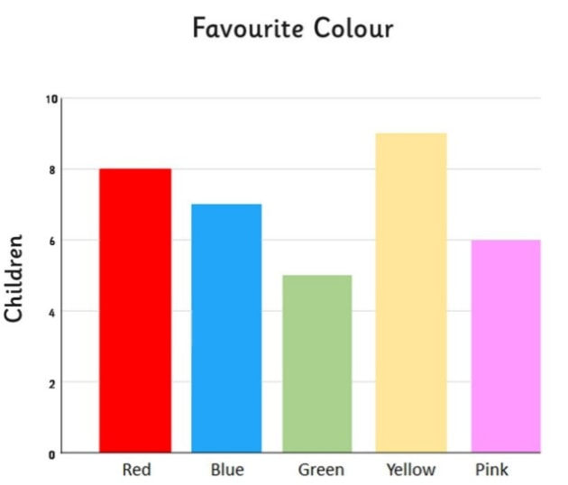
      

        
<strong>Best for</strong>: Comparing values across categories

        
<strong>Data type</strong>: Categorical with numeric values

      

    

    
<strong>Example use cases</strong>:

    <ul style="font-size: 14px; margin-top: 5px;">
      <li>Sales by product category</li>
      <li>Survey responses by demographic group</li>
      <li>Performance metrics across departments</li>
    </ul>
  

  

    <h6 style="margin-top: 0; margin-bottom: 5px;">Grouped Bar Charts</h6>
    

      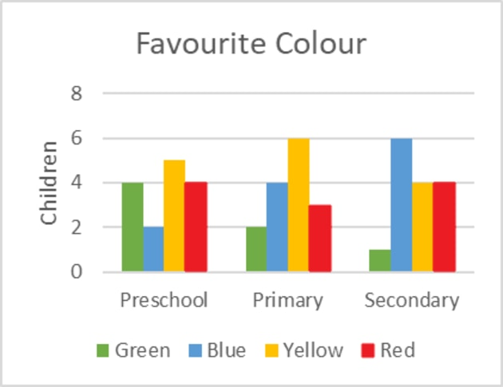
      

        
<strong>Best for</strong>: Comparing values across categories with subcategories

        
<strong>Data type</strong>: Categorical with multiple numeric variables

      

    

    
<strong>Example use cases</strong>:

    <ul style="font-size: 14px; margin-top: 5px;">
      <li>Sales by region and product category</li>
      <li>Expenses by department across quarters</li>
      <li>Test scores by school and subject</li>
    </ul>
  

  

    <h6 style="margin-top: 0; margin-bottom: 5px;">Radar/Spider Charts</h6>
    

      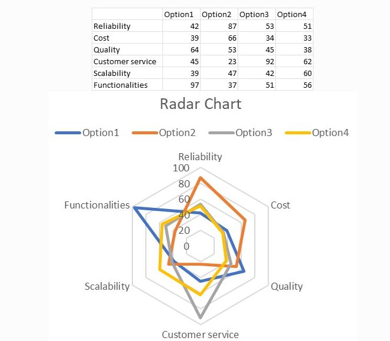
      

        
<strong>Best for</strong>: Comparing multiple variables across entities

        
<strong>Data type</strong>: Multiple metrics for comparison

      

    

    
<strong>Example use cases</strong>:

    <ul style="font-size: 14px; margin-top: 5px;">
      <li>Performance evaluations across multiple dimensions</li>
      <li>Product features comparison</li>
      <li>Skills assessment profiles</li>
    </ul>
  

  <h5 style="color: #2e7d32; margin-top: 0;"><strong>Time Series Visualizations</strong></h5>

  

    <h6 style="margin-top: 0; margin-bottom: 5px;">Line Charts</h6>
    

      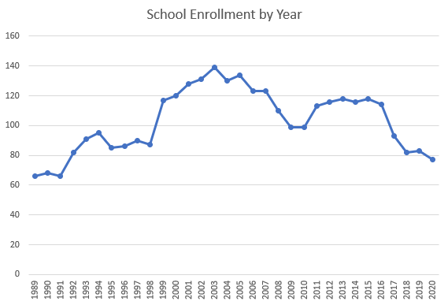
      

        
<strong>Best for</strong>: Showing trends over time

        
<strong>Data type</strong>: Time series

      

    

    
<strong>Example use cases</strong>:

    <ul style="font-size: 14px; margin-top: 5px;">
      <li>Stock price changes over time</li>
      <li>Monthly website traffic trends</li>
      <li>Temperature fluctuations through seasons</li>
    </ul>
  

  

    <h6 style="margin-top: 0; margin-bottom: 5px;">Area Charts</h6>
    

      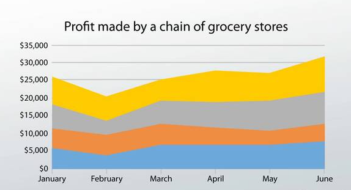
      

        
<strong>Best for</strong>: Showing volume over time

        
<strong>Data type</strong>: Time series with emphasis on magnitude

      

    

    
<strong>Example use cases</strong>:

    <ul style="font-size: 14px; margin-top: 5px;">
      <li>Market share evolution over time</li>
      <li>Cumulative project progress</li>
      <li>Website traffic sources over time</li>
    </ul>
  

  

    <h6 style="margin-top: 0; margin-bottom: 5px;">Candlestick Charts</h6>
    

      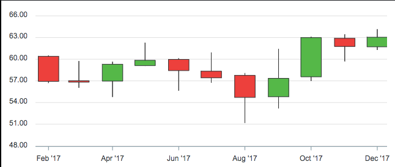
      

        
<strong>Best for</strong>: Showing price movement with open/close/high/low values

        
<strong>Data type</strong>: Time series with range data

      

    

    
<strong>Example use cases</strong>:

    <ul style="font-size: 14px; margin-top: 5px;">
      <li>Stock or cryptocurrency price movements</li>
      <li>Trading data analysis</li>
      <li>Price volatility patterns</li>
    </ul>
  

  <h5 style="color: #1565c0; margin-top: 0;"><strong>Distribution Visualizations</strong></h5>

  

    <h6 style="margin-top: 0; margin-bottom: 5px;">Histograms</h6>
    

      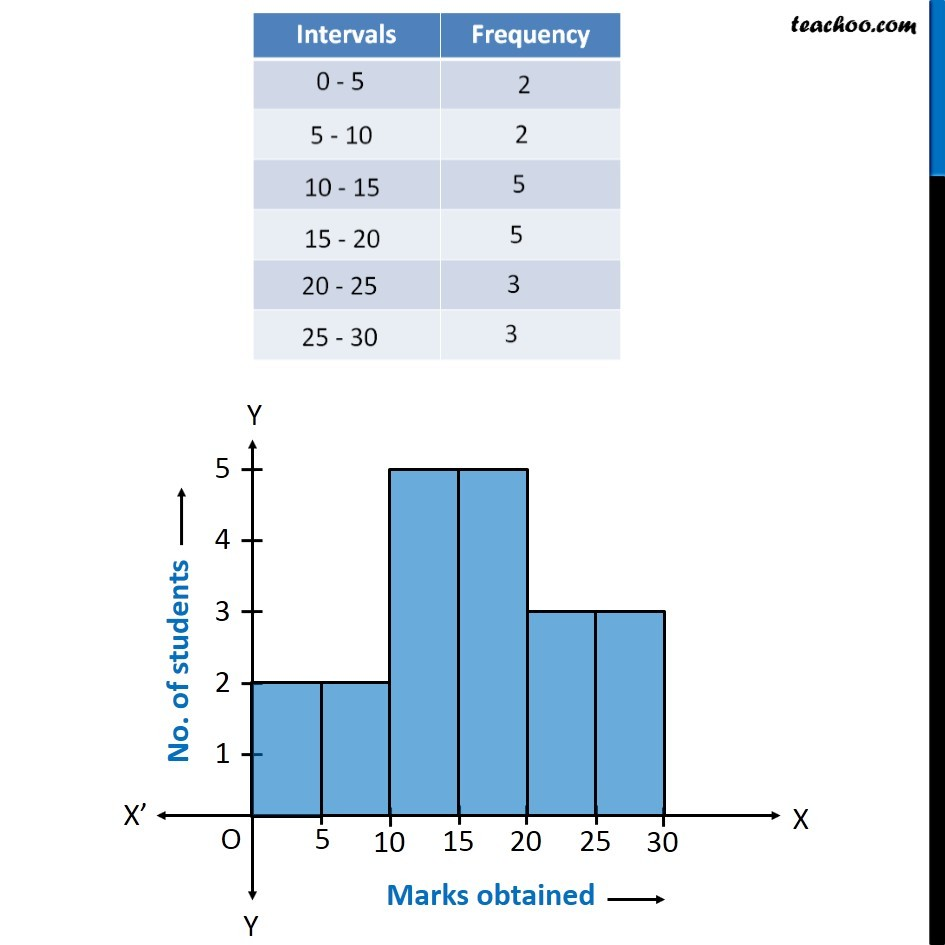
      

        
<strong>Best for</strong>: Showing distribution of a single variable

        
<strong>Data type</strong>: Continuous numeric data

      

    

    
<strong>Example use cases</strong>:

    <ul style="font-size: 14px; margin-top: 5px;">
      <li>Age distribution of customers</li>
      <li>Test score distributions</li>
      <li>Response time frequencies</li>
    </ul>
  

  

    <h6 style="margin-top: 0; margin-bottom: 5px;">Box Plots</h6>
    

      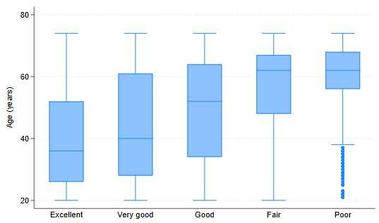
      

        
<strong>Best for</strong>: Showing data distribution with quartiles and outliers

        
<strong>Data type</strong>: Numeric data with statistical spread

      

    

    
<strong>Example use cases</strong>:

    <ul style="font-size: 14px; margin-top: 5px;">
      <li>Salary distributions by department</li>
      <li>Product performance variability</li>
      <li>Comparing data spread across groups</li>
    </ul>
  

  

    <h6 style="margin-top: 0; margin-bottom: 5px;">Violin Plots</h6>
    

      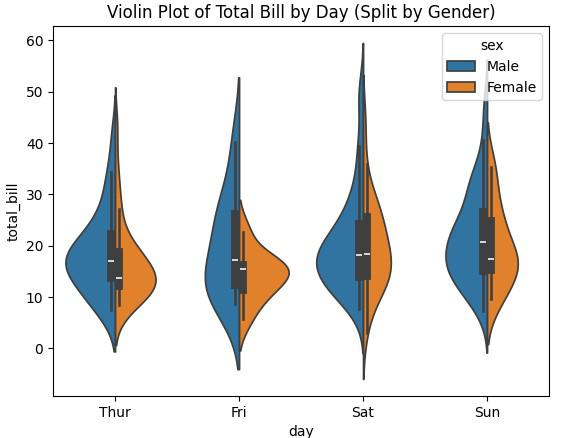
      

        
<strong>Best for</strong>: Showing density distribution and statistical summary

        
<strong>Data type</strong>: Continuous data with multiple distributions

      

    

    
<strong>Example use cases</strong>:

    <ul style="font-size: 14px; margin-top: 5px;">
      <li>Comparing distributions across categories</li>
      <li>Analyzing bimodal data patterns</li>
      <li>Customer rating distributions by product</li>
    </ul>
  

  <h5 style="color: #4527a0; margin-top: 0;"><strong>Relationship Visualizations</strong></h5>

  

    <h6 style="margin-top: 0; margin-bottom: 5px;">Scatter Plots</h6>
    

      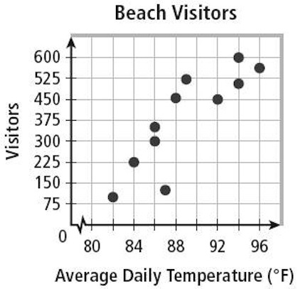
      

        
<strong>Best for</strong>: Showing relationship between two variables

        
<strong>Data type</strong>: Two numeric variables

      

    

    
<strong>Example use cases</strong>:

    <ul style="font-size: 14px; margin-top: 5px;">
      <li>Price vs. quality correlation</li>
      <li>Height vs. weight relationships</li>
      <li>Marketing spend vs. sales relationship</li>
    </ul>
  

  

    <h6 style="margin-top: 0; margin-bottom: 5px;">Bubble Charts</h6>
    

      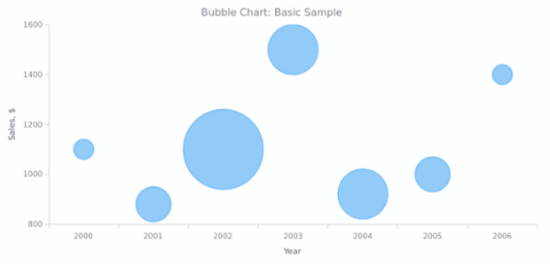
      

        
<strong>Best for</strong>: Showing relationship between three variables

        
<strong>Data type</strong>: Two numeric variables plus a third for bubble size

      

    

    
<strong>Example use cases</strong>:

    <ul style="font-size: 14px; margin-top: 5px;">
      <li>GDP per capita vs. life expectancy with population size</li>
      <li>Product features vs. price with sales volume</li>
      <li>Marketing channels by cost and conversion rate</li>
    </ul>
  

  

    <h6 style="margin-top: 0; margin-bottom: 5px;">Heatmaps</h6>
    

      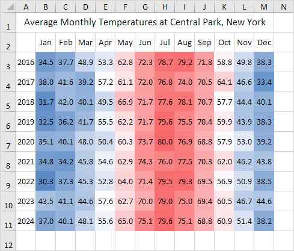
      

        
<strong>Best for</strong>: Showing patterns across two categorical dimensions

        
<strong>Data type</strong>: Matrix of values in two dimensions

      

    

    
<strong>Example use cases</strong>:

    <ul style="font-size: 14px; margin-top: 5px;">
      <li>Website activity by hour and day of week</li>
      <li>Correlation matrix between variables</li>
      <li>Performance metrics across regions and products</li>
    </ul>
  

  <h5 style="color: #00695c; margin-top: 0;"><strong>Composition Visualizations</strong></h5>

  

    <h6 style="margin-top: 0; margin-bottom: 5px;">Pie Charts</h6>
    

      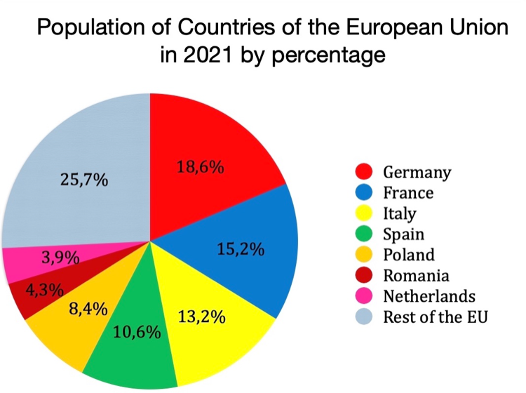
      

        
<strong>Best for</strong>: Showing parts of a whole (limited to 5-7 categories)

        
<strong>Data type</strong>: Categorical data as percentages of total

      

    

    
<strong>Example use cases</strong>:

    <ul style="font-size: 14px; margin-top: 5px;">
      <li>Market share distribution</li>
      <li>Budget allocation by department</li>
      <li>Traffic sources to a website</li>
    </ul>
  

  

    <h6 style="margin-top: 0; margin-bottom: 5px;">Stacked Bar Charts</h6>
    

      
      

        
<strong>Best for</strong>: Showing composition and total values across categories

        
<strong>Data type</strong>: Categorical with subcategories and values

      

    

    
<strong>Example use cases</strong>:

    <ul style="font-size: 14px; margin-top: 5px;">
      <li>Revenue breakdown by product and region</li>
      <li>Population demographics over time</li>
      <li>Survey responses across multiple questions</li>
    </ul>
  

  

    <h6 style="margin-top: 0; margin-bottom: 5px;">Treemaps</h6>
    

      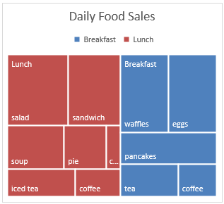
      

        
<strong>Best for</strong>: Hierarchical data with nested categories

        
<strong>Data type</strong>: Hierarchical categorical data with values

      

    

    
<strong>Example use cases</strong>:

    <ul style="font-size: 14px; margin-top: 5px;">
      <li>File system storage allocation</li>
      <li>Product categories and subcategories by sales</li>
      <li>Organizational structure with performance metrics</li>
    </ul>
  

  <h5 style="color: #ad1457; margin-top: 0;"><strong>Spatial Visualizations</strong></h5>

  

    <h6 style="margin-top: 0; margin-bottom: 5px;">Choropleth Maps</h6>
    

      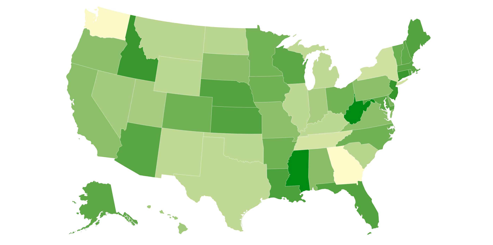
      

        
<strong>Best for</strong>: Showing values across geographic areas

        
<strong>Data type</strong>: Geographic data with associated values

      

    

    
<strong>Example use cases</strong>:

    <ul style="font-size: 14px; margin-top: 5px;">
      <li>Population density by region</li>
      <li>Sales performance across territories</li>
      <li>Election results by district</li>
    </ul>
  

  

    <h6 style="margin-top: 0; margin-bottom: 5px;">Point Maps</h6>
    

      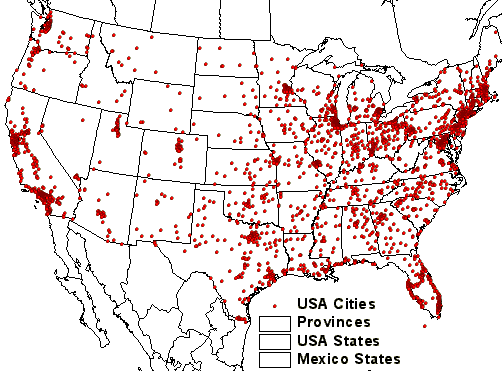
      

        
<strong>Best for</strong>: Showing individual locations

        
<strong>Data type</strong>: Geographic coordinates with attributes

      

    

    
<strong>Example use cases</strong>:

    <ul style="font-size: 14px; margin-top: 5px;">
      <li>Store locations with performance data</li>
      <li>Customer distribution in a region</li>
      <li>Event locations with attendance figures</li>
    </ul>
  

  

    <h6 style="margin-top: 0; margin-bottom: 5px;">Flow Maps</h6>
    

      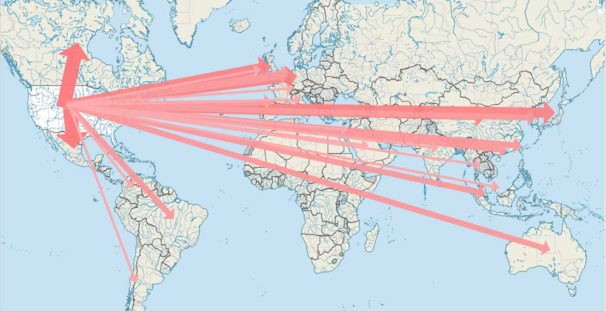
      

        
<strong>Best for</strong>: Showing movement between locations

        
<strong>Data type</strong>: Origin-destination pairs with volumes

      

    

    
<strong>Example use cases</strong>:

    <ul style="font-size: 14px; margin-top: 5px;">
      <li>Migration patterns between countries</li>
      <li>Supply chain and logistics flows</li>
      <li>Customer movement between store locations</li>
    </ul>
  

  <h5 style="color: #d84315; margin-top: 0;"><strong>Specialized Visualizations</strong></h5>

  

    <h6 style="margin-top: 0; margin-bottom: 5px;">Network Graphs</h6>
    

      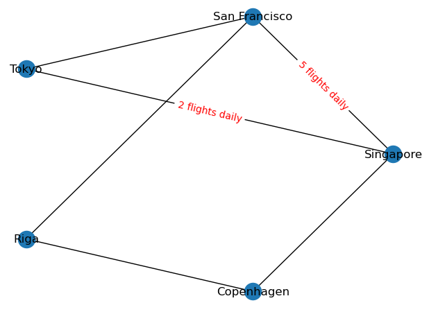
      

        
<strong>Best for</strong>: Showing relationships and connections between entities

        
<strong>Data type</strong>: Node-link data with relationships

      

    

    
<strong>Example use cases</strong>:

    <ul style="font-size: 14px; margin-top: 5px;">
      <li>Social network analysis</li>
      <li>Organization connections and hierarchies</li>
      <li>Product recommendation systems</li>
    </ul>
  

  

    <h6 style="margin-top: 0; margin-bottom: 5px;">Sankey Diagrams</h6>
    

      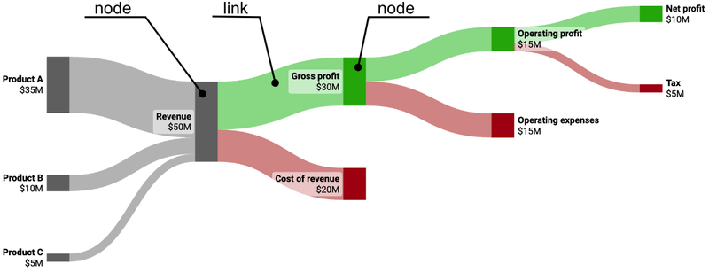
      

        
<strong>Best for</strong>: Showing flow quantities between categories or stages

        
<strong>Data type</strong>: Flow data between nodes

      

    

    
<strong>Example use cases</strong>:

    <ul style="font-size: 14px; margin-top: 5px;">
      <li>Website user flow analysis</li>
      <li>Energy transfer diagrams</li>
      <li>Budget flow between departments</li>
    </ul>
  

  

    <h6 style="margin-top: 0; margin-bottom: 5px;">Funnel Charts</h6>
    

      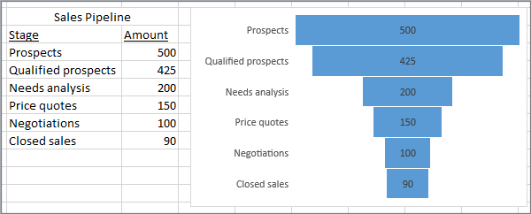
      

        
<strong>Best for</strong>: Showing sequential process and drop-offs

        
<strong>Data type</strong>: Sequential steps with decreasing values

      

    

    
<strong>Example use cases</strong>:

    <ul style="font-size: 14px; margin-top: 5px;">
      <li>Sales conversion funnel</li>
      <li>Recruitment process stages</li>
      <li>Customer journey analysis</li>
    </ul>
  

<h4 style="color: #ef6c00; margin-top: 30px;">📝 Choosing the Right Visualization</h4>

  <h5 style="margin-top: 0;">Step-by-Step Decision Guide</h5>
  <ol style="margin-bottom: 0;">
    <li><strong>Define your purpose</strong>: What question are you trying to answer?</li>
    <li><strong>Identify your data type</strong>: Categorical, numerical, time-series, geographic, etc.</li>
    <li><strong>Consider your audience</strong>: Technical understanding, preferences, and needs</li>
    <li><strong>Determine the relationship</strong> you want to show: Comparison, composition, distribution, relationship, or trend</li>
    <li><strong>Match the visualization</strong> to the purpose and data type using the guide above</li>
    <li><strong>Simplify and refine</strong>: Remove clutter, emphasize important points, use consistent colors</li>
  </ol>

  

    <h5 style="color: #2e7d32; margin-top: 0;">✅ Best Practices</h5>
    <ul style="margin-bottom: 0;">
      <li>Start with the question, not the chart type</li>
      <li>Use color purposefully and consistently</li>
      <li>Provide clear titles, labels, and legends</li>
      <li>Maintain appropriate aspect ratios</li>
      <li>Use interactive elements strategically</li>
      <li>Consider accessibility for colorblind users</li>
    </ul>
  

  

    <h5 style="color: #c62828; margin-top: 0;">❌ Common Pitfalls</h5>
    <ul style="margin-bottom: 0;">
      <li>Using pie charts with too many categories</li>
      <li>Truncating axes to exaggerate differences</li>
      <li>Using 3D charts that distort perception</li>
      <li>Overcomplicating with unnecessary chart junk</li>
      <li>Choosing the wrong chart type for your data</li>
      <li>Using misleading color scales</li>
    </ul>
  

---

## 3. 🧰 Tools Used in the Data Analysis Lifecycle

  <h3 style="color: #1565c0; text-align: center;">📥 Data Collection Tools</h3>
  <ul>
    <li><strong>Survey Platforms</strong>: SurveyMonkey, Google Forms, Qualtrics</li>
    <li><strong>Database Management Systems</strong>: MySQL, PostgreSQL, MongoDB</li>
    <li><strong>API Integration Tools</strong>: Postman, Zapier, IFTTT</li>
    <li><strong>Web Scraping</strong>: BeautifulSoup, Scrapy, Octoparse</li>
    <li><strong>IoT Data Collection</strong>: Arduino, Raspberry Pi, Sensor platforms</li>
  </ul>

  <h3 style="color: #2e7d32; text-align: center;">🧹 Data Cleaning Tools</h3>
  <ul>
    <li><strong>Spreadsheet Software</strong>: Microsoft Excel, Google Sheets</li>
    <li><strong>Data Wrangling Libraries</strong>: Pandas (Python), dplyr (R)</li>
    <li><strong>ETL Tools</strong>: Talend, Informatica, Apache NiFi</li>
    <li><strong>Data Quality Tools</strong>: OpenRefine, Trifacta, Dataprep</li>
    <li><strong>SQL Tools</strong>: DBeaver, pgAdmin, MySQL Workbench</li>
  </ul>

  <h3 style="color: #7b1fa2; text-align: center;">🔍 Data Exploration Tools</h3>
  <ul>
    <li><strong>Statistical Analysis Software</strong>: R, SPSS, SAS</li>
    <li><strong>Programming Languages</strong>: Python, R, Julia</li>
    <li><strong>Notebook Environments</strong>: Jupyter, RStudio, Colab</li>
    <li><strong>Business Intelligence</strong>: Tableau, Power BI, Looker</li>
    <li><strong>Big Data Platforms</strong>: Apache Hadoop, Spark, Flink</li>
  </ul>

  <h3 style="color: #ef6c00; text-align: center;">📊 Data Visualization Tools</h3>
  <ul>
    <li><strong>Visualization Libraries</strong>: Matplotlib, ggplot2, D3.js</li>
    <li><strong>Dashboard Tools</strong>: Tableau, Power BI, Grafana</li>
    <li><strong>Mapping Tools</strong>: QGIS, ArcGIS, Mapbox</li>
    <li><strong>Infographic Creators</strong>: Piktochart, Canva, Infogram</li>
    <li><strong>Interactive Viz Tools</strong>: Plotly, Bokeh, Shiny</li>
  </ul>

  <h3 style="color: #0097a7; text-align: center;">📢 Communication Tools</h3>
  <ul>
    <li><strong>Presentation Software</strong>: PowerPoint, Keynote, Google Slides</li>
    <li><strong>Reporting Tools</strong>: R Markdown, Jupyter, Quarto</li>
    <li><strong>Collaboration Platforms</strong>: Notion, Confluence, SharePoint</li>
    <li><strong>Version Control</strong>: GitHub, GitLab, Bitbucket</li>
    <li><strong>Documentation</strong>: LaTeX, Sphinx, ReadTheDocs</li>
  </ul>

  <h3 style="color: #424242; text-align: center;">⚙️ Decision-Making Tools</h3>
  <ul>
    <li><strong>Project Management</strong>: Jira, Trello, Asana</li>
    <li><strong>Process Automation</strong>: Zapier, Microsoft Power Automate</li>
    <li><strong>KPI Dashboards</strong>: Geckoboard, Databox, Klipfolio</li>
    <li><strong>A/B Testing Platforms</strong>: Optimizely, Google Optimize</li>
    <li><strong>Workflow Tools</strong>: Monday.com, ClickUp, Microsoft Planner</li>
  </ul>

---

## 4. 🏆 Case Study Walkthrough: Retail Store Customer Analysis

Let's walk through a practical example of how the data analysis lifecycle applies to a business scenario:

<strong>💼 Business Context</strong>: A retail clothing store wants to improve its marketing strategy by better understanding customer purchasing patterns and preferences.

  <h3 style="color: #1565c0; text-align: center;">📥 Stage 1: Data Collection</h3>

  <h4><strong>Question</strong>:</h4>
  
What factors influence customer purchasing behavior in our store?

  <h4><strong>Data Sources</strong>:</h4>
  <ul>
    <li>Point of Sale (POS) transaction data</li>
    <li>Customer loyalty program data</li>
    <li>Store foot traffic data</li>
    <li>Marketing campaign history</li>
    <li>Customer feedback surveys</li>
  </ul>

  <h4><strong>Collection Methods</strong>:</h4>
  <ul>
    <li>Export of 6 months of transaction data from POS system</li>
    <li>Query of customer database for demographic information</li>
    <li>Analysis of in-store traffic counter logs</li>
    <li>Export of email marketing campaign performance data</li>
  </ul>

  <h3 style="color: #2e7d32; text-align: center;">🧹 Stage 2: Data Cleaning</h3>

  <h4><strong>Key Cleaning Tasks</strong>:</h4>
  <ul>
    <li>Removed duplicate transaction records (285 duplicates found)</li>
    <li>Standardized product categories across different systems</li>
    <li>Fixed inconsistent date formats across data sources</li>
    <li>Created age group categories from birth date information</li>
    <li>Merged transaction data with customer information using customer ID</li>
  </ul>

  <h4><strong>Data Issues Addressed</strong>:</h4>
  <ul>
    <li>3.2% of transactions had missing loyalty numbers – excluded from customer analysis but kept for overall sales analysis</li>
    <li>5% of customer records had incomplete demographic data – used partial information where available</li>
    <li>Some product categories were inconsistently named (e.g., "Men's Wear" vs. "Menswear") – created standardized category list</li>
  </ul>

  <h3 style="color: #7b1fa2; text-align: center;">🔍 Stage 3: Data Exploration</h3>

  <h4><strong>Initial Findings</strong>:</h4>
  <ul>
    <li>Average purchase amount: $68.45</li>
    <li>Most active customer segment: women ages 25-34</li>
    <li>Peak shopping times: Saturday 12-3pm, Thursday 5-7pm</li>
    <li>Products most commonly purchased together: jeans and t-shirts</li>
    <li>72% of high-value customers (>$200/month) are loyalty program members</li>
  </ul>

  <h4><strong>Statistical Analysis</strong>:</h4>
  <ul>
    <li>Correlation analysis between purchase frequency and discount offerings</li>
    <li>Segmentation of customers by purchasing behavior</li>
    <li>Trend analysis of seasonal purchasing patterns</li>
    <li>Association rule mining for product bundling opportunities</li>
  </ul>

  <h3 style="color: #ef6c00; text-align: center;">📊 Stage 4: Data Visualization</h3>

  <h4><strong>Visualizations Created</strong>:</h4>
  <ul>
    <li>Heat map of store traffic by day and hour</li>
    <li>Bar chart of sales by product category and customer age group</li>
    <li>Scatter plot of purchase amount vs. frequency with loyalty status highlighting</li>
    <li>Line chart showing promotional response rates over time</li>
    <li>Geospatial map of customer distribution by zip code</li>
  </ul>

  

    
  

  <h3 style="color: #0097a7; text-align: center;">📢 Stage 5: Communication</h3>

  <h4><strong>Key Insights Communicated</strong>:</h4>
  <ul>
    <li>Loyalty members spend 45% more annually than non-members</li>
    <li>Email promotions have 3x higher conversion rates when sent on Sundays</li>
    <li>Customers who try items in fitting rooms have a 70% higher purchase rate</li>
    <li>The 30-40 age group has the highest average transaction value but visits less frequently</li>
  </ul>

  <h4><strong>Recommendations Provided</strong>:</h4>
  <ul>
    <li>Increase fitting room attendant staffing during peak hours</li>
    <li>Create targeted promotions for high-value but less frequent shoppers</li>
    <li>Develop a "complete the look" merchandising strategy for commonly paired items</li>
    <li>Adjust email marketing schedule to focus on Sunday sends</li>
  </ul>

  <h3 style="color: #424242; text-align: center;">⚙️ Stage 6: Decision-Making</h3>

  <h4><strong>Implemented Actions</strong>:</h4>
  <ul>
    <li>Redesigned store layout to place commonly purchased items closer together</li>
    <li>Created a new loyalty tier for high-value customers with personalized offers</li>
    <li>Adjusted staffing schedule to align with identified peak shopping times</li>
    <li>Launched a targeted win-back campaign for lapsed high-value customers</li>
  </ul>

  <h4><strong>Monitoring Plan</strong>:</h4>
  <ul>
    <li>Weekly tracking of average transaction value</li>
    <li>Monthly analysis of cross-category purchasing</li>
    <li>Quarterly review of loyalty program effectiveness</li>
    <li>A/B testing of new email marketing schedule</li>
  </ul>

  <h4><strong>Results After 3 Months</strong>:</h4>
  <ul>
    <li>12% increase in average transaction value</li>
    <li>8% growth in loyalty program membership</li>
    <li>15% improvement in email marketing conversion rates</li>
    <li>5% overall revenue growth compared to same period last year</li>
  </ul>

---

## 📝 Activity: Data Analysis Lifecycle Application

### Case Study: Public Library Usage Analysis (30 minutes)

<h4 style="margin-top: 0; color: #8a6d3b;">💬 Scenario:</h4>

A public library system wants to understand how to better allocate resources and improve services based on patron usage patterns.

<h4 style="margin-top: 0;">Instructions</h4>

Working in groups of 3-4, develop a plan for each stage of the data analysis lifecycle for this scenario:

  <h4 style="margin-top: 0; color: #1565c0;"><strong>1. Data Collection</strong> (5 minutes)</h4>
  <ul>
    <li>What specific questions should the analysis answer?</li>
    <li>What data sources would you need?</li>
    <li>What collection methods would you use?</li>
  </ul>

  <h4 style="margin-top: 0; color: #2e7d32;"><strong>2. Data Cleaning and Preparation</strong> (5 minutes)</h4>
  <ul>
    <li>What data quality issues might you expect?</li>
    <li>How would you handle incomplete records?</li>
    <li>What data transformations would be necessary?</li>
  </ul>

  <h4 style="margin-top: 0; color: #7b1fa2;"><strong>3. Data Exploration and Analysis</strong> (5 minutes)</h4>
  <ul>
    <li>What initial analyses would you perform?</li>
    <li>What metrics or KPIs would be most relevant?</li>
    <li>What statistical methods might be appropriate?</li>
  </ul>

  <h4 style="margin-top: 0; color: #ef6c00;"><strong>4. Data Visualization</strong> (5 minutes)</h4>
  <ul>
    <li>What key visualizations would you create?</li>
    <li>How would you design dashboards for different stakeholders?</li>
    <li>What tools would you recommend?</li>
  </ul>

  <h4 style="margin-top: 0; color: #0097a7;"><strong>5. Communication and Action</strong> (5 minutes)</h4>
  <ul>
    <li>Who are the key stakeholders for your findings?</li>
    <li>How would you structure your recommendations?</li>
    <li>What actions might result from your analysis?</li>
  </ul>

  <h4 style="margin-top: 0;">⏱️ Discussion Timeline</h4>
  

    
20m

    

      Group work on analysis plan
    

  

  

    
10m

    

      Presentation and discussion
    

  

---

## 📚 Additional Resources

  

    <h3 style="margin-top: 0;">📕 Recommended Reading</h3>
    <ul>
      <li><a href="https://data-science-for-biz.com/" style="text-decoration: none; color: #0277bd;">
        <strong>"Data Science for Business"</strong> by Foster Provost & Tom Fawcett</a>
        
Fundamental principles of data science and business applications

      </li>
      <li><a href="https://www.storytellingwithdata.com/" style="text-decoration: none; color: #0277bd;">
        <strong>"Storytelling with Data"</strong> by Cole Nussbaumer Knaflic</a>
        
Learn how to effectively communicate insights through data visualization

      </li>
      <li><a href="https://www.oreilly.com/library/view/the-data-science/9781491938683/" style="text-decoration: none; color: #0277bd;">
        <strong>"The Data Science Process"</strong> by Jeffrey Stanton</a>
        
A comprehensive guide to the processes of data science

      </li>
    </ul>
  

  

    <h3 style="margin-top: 0;">🔗 Online Resources</h3>
    <ul>
      <li><a href="https://www.coursera.org/professional-certificates/google-data-analytics" style="text-decoration: none; color: #0277bd;">
        <strong>Google's Data Analytics Professional Certificate</strong></a>
        
Comprehensive online course covering all aspects of data analysis

      </li>
      <li><a href="https://towardsdatascience.com/the-data-analysis-process-5-steps-to-better-decision-making-bd292d0c2d6a" style="text-decoration: none; color: #0277bd;">
        <strong>The Data Analysis Process</strong></a>
        
Article explaining the data analysis process step-by-step

      </li>
      <li><a href="https://www.ibm.com/cloud/architecture/architecture/practices/data-science-methodology-overview/" style="text-decoration: none; color: #0277bd;">
        <strong>IBM's Data Science Methodology</strong></a>
        
Professional perspective on data science methodology

      </li>
    </ul>
  

---

## 📋 Homework

  <h3 style="margin-top: 0;">✍️ Assignment Tasks</h3>

  

    
1

    

      
<strong>Select a public dataset of interest from <a href="https://www.kaggle.com/datasets" style="color: #0277bd;">Kaggle</a> or <a href="https://data.gov" style="color: #0277bd;">Data.gov</a></strong>

      
Choose something related to your interests or professional field

    

  

    
2

    

      
<strong>Document a plan for applying the data analysis lifecycle to this dataset</strong>

      
Create a brief outline for each of the six stages we discussed

    

  

  

    
3

    

      
<strong>Complete the first three stages (Collection, Cleaning, and Exploration) with basic outputs</strong>

      
Document your process and include example outputs from each stage

    

  

  

    
4

    

      
<strong>Create one visualization that effectively communicates a key insight from your analysis</strong>

      
Include an explanation of why you chose this visualization and what insight it reveals

    

  

  

    

      
📅

      
<strong>Due date:</strong> May 17, 2025 (before next class)

    

    

      
📝

      
<strong>Submission format:</strong> Jupyter Notebook or PDF document via the course portal

    

  

  <h3 style="margin-top: 0; display: flex; align-items: center;">💪 Challenge Exercise (Optional)</h3>
  
Complete the entire data analysis lifecycle for your selected dataset, including all six stages. Create a dashboard or presentation that could be delivered to stakeholders with actionable recommendations based on your findings.

  

    
<strong>Tip:</strong> For the Decision-Making stage, you can create hypothetical scenarios about how your insights might inform real-world actions or policies.

  

---

  

    <strong>🗓️ Today:</strong> May 10, 2025
  

  

    
Next Lesson: Introduction to Data Visualization

    
Date: May 17, 2025

  

  

    ✓ <strong>Lesson 3 Complete</strong> - 3 of 6 ✓ 
    

      

    

  

